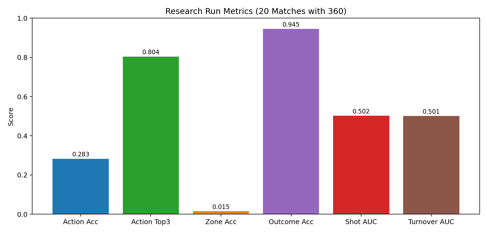
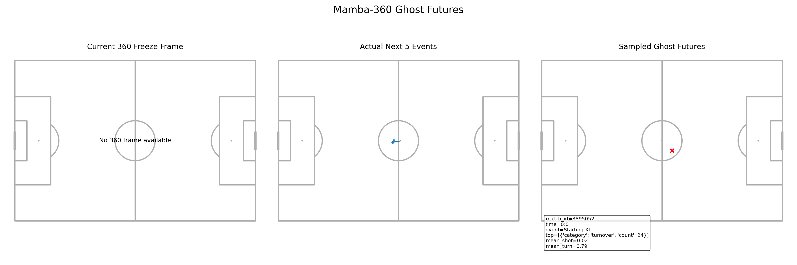

# Mamba-360 Ghost Futures

A football world-model MVP that uses StatsBomb event sequences and 360 freeze frames to sample and visualize plausible next-event futures.

## What This Repository Does

- Loads StatsBomb Open Data with 360 freeze-frame coverage
- Builds robust event-level and 360 handcrafted contextual features
- Trains a next-event multi-task sequence model (Mamba if available, GRU fallback otherwise)
- Samples 5-step ghost futures autoregressively
- Produces analyst-readable pitch case studies (current frame, actual future, sampled futures)

## Setup

```bash
python -m venv .venv
source .venv/bin/activate
pip install -r requirements.txt
```

Optional Mamba backend:

```bash
pip install -r requirements-mamba.txt
```

If Mamba is unavailable, the system automatically falls back to GRU.

## Reproducing The Research Run (20 Matches)

```bash
python scripts/01_cache_statsbomb_data.py --config configs/research.yaml --competition-id 9 --season-id 281
python scripts/02_build_dataset.py --config configs/research.yaml
python scripts/03_train_model.py --config configs/research.yaml --processed-path data/processed/dataset.pt --output outputs/checkpoints/research_model.pt
python scripts/04_evaluate_model.py --config configs/research.yaml --checkpoint outputs/checkpoints/research_model_best.pt --output outputs/metrics/research_eval_metrics.json
python scripts/05_make_case_study.py --config configs/research.yaml --checkpoint outputs/checkpoints/research_model_best.pt --output outputs/case_studies/research_case_study.png
```

Notes:
- `competition_id=9`, `season_id=281` corresponds to Bundesliga 2023/24.
- `configs/research.yaml` is configured for `max_matches=20`.

## Latest Quantitative Results (20-Match Run)

From `outputs/metrics/research_eval_metrics.json`:

- `action_accuracy`: `0.2827`
- `action_top3_accuracy`: `0.8037`
- `zone_accuracy`: `0.0150`
- `outcome_accuracy`: `0.9449`
- `shot_next_5_auc`: `0.5020`
- `turnover_next_3_auc`: `0.5006`

Interpretation:
- Action top-3 signal is materially stronger than top-1, which indicates high uncertainty in next-action identity.
- Zone and future-risk heads are currently near-chance in this baseline setup, so this should be treated as a foundation model run rather than a final performance claim.
- The current value of the project is in end-to-end robustness and qualitative scenario generation, with clear next steps for model improvement.



## Qualitative Case Study

The generated case-study figure compares:
- Current 360 freeze frame
- Actual next 5 events
- Model-sampled ghost futures

Reasoning value:
- Even when scalar predictive metrics are modest, the qualitative view exposes whether sampled trajectories are spatially and contextually plausible.
- This helps diagnose where the model is realistic versus where it collapses to generic low-information continuations.



## Outputs

- `outputs/checkpoints/`: checkpoints
- `outputs/metrics/`: evaluation JSON
- `outputs/case_studies/`: case-study PNG and summary JSON

## Project Structure

Core implementation is in `src/`:
- `src/data`: ingestion, cleaning, 360 feature engineering, vocab/sequences, splits
- `src/models`: encoder, backbones, heads, loss
- `src/training`: train/eval/metrics
- `src/generation`: rollout and future summarization
- `src/visualization`: pitch drawing and case-study plotting
- `src/utils`: config, io, geometry, StatsBomb-safe extractors

## Scientific Report

Detailed methodology, assumptions, and improvement roadmap:

- [docs/SCIENTIFIC_REPORT.md](docs/SCIENTIFIC_REPORT.md)
